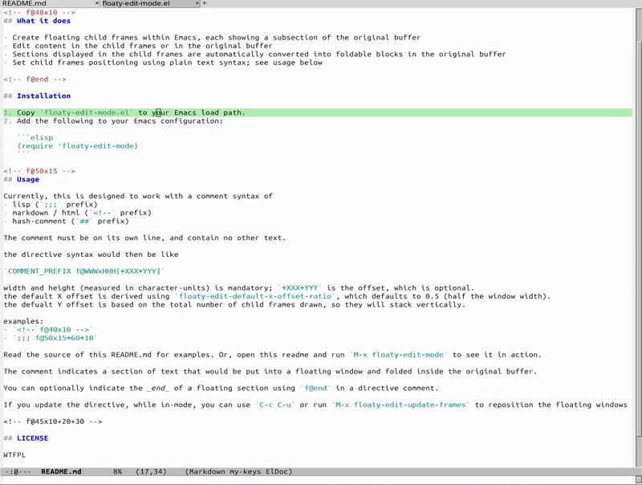

# Floaty Edit Mode for Emacs

Floaty Edit Mode is a minor mode for Emacs that enables editing with floating windows (aka "child frames" in emacs).

<!-- f@40x10 -->
## What it does



- Create floating child frames within Emacs, each showing a subsection of the original buffer
- Edit content in the child frames or in the original buffer
- Sections displayed in the child frames are automatically converted into foldable blocks in the original buffer
- Set child frames positioning using plain text syntax; see usage below

<!-- f@end -->

## Installation

1. Copy `floaty-edit-mode.el` to your Emacs load path.
2. Add the following to your Emacs configuration:

   ```elisp
   (require 'floaty-edit-mode)
   ```

<!-- f@50x15 -->
## Usage

Currently, this is designed to work with a comment syntax of
- lisp (`;;;` prefix)
- markdown / html (`<!--` prefix)
- hash-comment (`##` prefix)

The comment must be on its own line, and contain no other text.

the directive syntax would then be like

`COMMENT_PREFIX f@WWWxHHH[+XXX+YYY]`

width and height (measured in character-units) is mandatory; `+XXX+YYY` is the offset, which is optional.
the default X offset is derived using `floaty-edit-default-x-offset-ratio`, which defaults to 0.5 (half the window width).
the defualt Y offset is based on the total number of child frames drawn, so they will stack vertically.

examples:
- `<!-- f@40x10 -->`
- `;;; f@50x15+60+10`

Read the source of this README.md for examples. Or, open this readme and run `M-x floaty-edit-mode` to see it in action.

The comment indicates a section of text that would be put into a floating window and folded inside the original buffer.

You can optionally indicate the _end_ of a floating section using `f@end` in a directive comment.

If you update the directive, while in-mode, you can use `C-c C-u` or run `M-x floaty-edit-update-frames` to reposition the floating windows

<!-- f@45x10+20+30 -->

## LICENSE

WTFPL

## Attribution

- Emacs maintainers and package contributors
- all of humanity who have contributed knowledge
- Claude 3.5 Sonnet for most of the code
